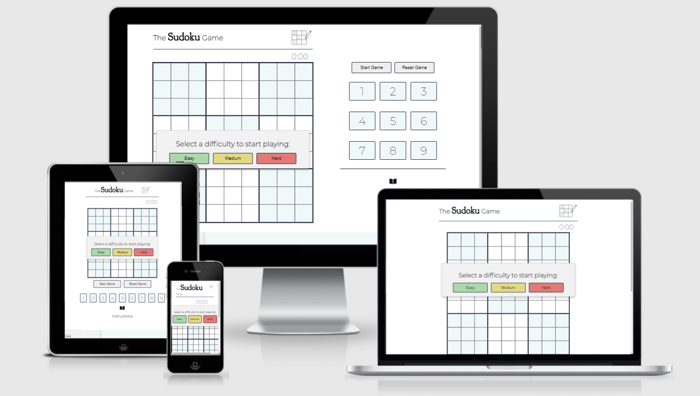
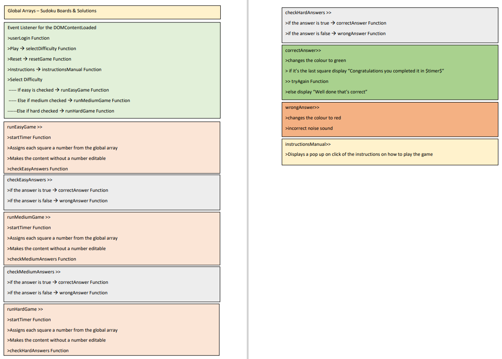
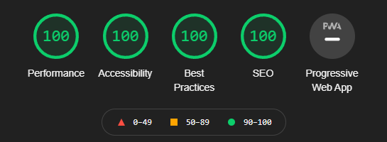

[Live Link](https://sophiebatten123.github.io/SudokuGame/)

[GitHub Repository](https://github.com/sophiebatten123/SudokuGame)

# The SUDOKU Game

Loose yourself in mathematical puzzles and give your mind that ‘me time’ it deserves. This website will help you to find peace in a frantic world, by putting your worries to one side. Your brain will be given a gentle workout, leaving you feeling fresh and at rest. 

To solve a sudoku puzzle, you must use a combination of logic, trial and error and mathematical thinking. The aim of the game is to complete every square, row, and column using only the numbers 1-9, all of which can only appear once.

The site itself is fully responsive and is designed in a simplistic and easy to read manner. 

# Contents

- [UX](#ux)
  - [User Stories](#user-stories)
  - [Design](#design)
    - [Colour Scheme](#colour-scheme)
    - [Typography](#typography)
    - [Imagery](#imagery)
  - [Wireframes](#wireframes)
    - [Desktop Wireframe](#desktop-wireframe)
    - [Mobile Wireframe](#mobile-wireframe)
    - [Logic Functions Wireframe](#logic-functions-wireframe)
    - [Site Improvements](#site-improvements)
  - [Features](#features)
    - [Game Board](#game-board)
    - [Game Keypad](#game-keypad)
    - [Game Buttons](#game-buttons)
    - [Instructions](#instructions)
    - [Game Complete](#game-complete)
  - [Deployed Website](#deployed-website)
    - [Desktop Game](#desktop-game)
    - [Mobile Game](#mobile-game)
 - [Functionality](#functionality)
# UX

## User Stories

### First Time Visitor Goals:
- As a First Time Visitor, I should be able to easily navigate the website and create a game board based upon the difficulty selection.
- As a First Time Visitor, I should be able to read instructions on how to play Sudoku, these should be clear and easy to understand.

### Returning Visitor Goals:
- As a Returning Visitor, I should be able to see the time taken to complete the puzzle and be competing against my personal best.
- As a Returning Visitor, I should have the option to create a Sudoku account. This will allow me to store high scores and compete against myself.

### Frequent Visitor Goals:
- As a Frequent User, I should have the option to increase the difficulty of puzzles I complete.
- As a Frequent User, I should be able to login to my Sudoku account to access high scores and challenge myself to beat these times.

# Design

## Colour Scheme

The sites primary colours are blues and whites. The image above displays the original colour scheme chosen for the website. The colour palette was created using [coolors](https://coolors.co/). 

These colours were chosen based on peace and tranquillity aiming to relax the user and prevent strain on their eyes during the game. Pastel shades were chosen to create a soft texture to the website; whilst ensuring text behind was readable.

    
Colour Scheme - Click Here:

    

#
## Typography

The websites main text was written against a white background ensuring that the text was clear and stood out to the user.

‘Montserrat’ was the main font used on the website with ‘San Serif’ as a fallback font. This font was chosen based upon the curvature of the letters, creating a soft appearance against a harsh white background.

    
Title Font - Click Here:

    

## Imagery

An instruction manual was chosen and a logo drawn to brighten up a plain page whilst also improving the accessibility of the site. These elements contributed towards the soft texture of the site, making the users experience more relaxing.

    
Logo - Click Here:

    

# Wireframes

-To ensure that I was being efficient in my coding I created wireframes before starting, this gave me an outline of what the website should look like and how I should incorporate logic functions into JavaScript. 

The links to these can be found below for both desktop and mobile devices:

## Desktop Wireframe

    
Sudoku Desktop Wireframe - Click Here:

    

## Mobile Wireframe

    
Sudoku Mobile Wireframe - Click Here:

    

## Logic Function Wireframe

    
Sudoku Functions Wireframe - Click Here:

    

# Site Improvements

Some alterations were made from the original wireframe designs to improve User Experience (UX) including: 
- The difficulty selection was changed into a drop-down menu due to the site containing too much text and looking overcrowded. It was imperative that the site remaining simplistic and therefore this change was important.
- An on-screen keypad was created to improve User Experience on a mobile device. After user testing it was apparent that using a mobile keypad to play the game was exhausting and therefore by creating an on-screen keypad it made the game easier to navigate.

# Features

## Game Board

## Game Keypad

## Game Buttons

## Instructions

## Game Complete

# Deployed Website

## Desktop Game

Above is a screenshot of the deployed website in desktop view. It was imperative throughout the design process that the game board occupied over half of the screen area; ensuring that this was the main focus to the user. 

The keypad was designed to ensure buttons could easily be accessed and that accidental clicks would be kept to a minimum during the game

## Mobile Game

A screenshot of the website from a mobile device can be seen above. Content was centered to ensure that the user could see the game board clearly and the keypad was aligned for ease of clicking.

# Functionality

## Logic Functions

- Before starting the JavaScript code within the site, I found it useful to plan the functions needed for the site to work. By doing this I was able to ensure efficiency within the code and structure my work better for deployment.

## Fixed Bugs and Errors

## Technologies Used

## Programs Used

# Testing

## Manual Testing

Manual testing was completed throughout the entire project and the website was continually tested on different browsers and on different screen sizes. Dev tools was used to recognise and spot errors within the code allowing me to regularly use the ‘debugger’ tool to analyse logic functions. 

Furthermore, I regularly generated lighthouse reports giving me an indication of how well the website was performing. Attached below is a screenshot of my lighthouse report at the deployment stage of my project:

## Automatic Testing

Automatic testing of the HTML and CSS code was checked using W3C Validator ensuring that there were no errors or warnings within the code. When the website was ran through the validator no warnings or errors were present when the site was deployed.

Attached below is a screenshot of the HTML and CSS Validator showing no errors or warnings when the website was deployed. 

## WAVE Testing

WAVE was used to check the accessibility of ‘The Sudoku Game’ this was to ensure that the game was made accessible to users with disabilities. This tool highlighted errors and warnings that could prevent a disabled user using the site including: 

- Underlined heading was removed to improve accessibility on the website for impaired readers.

Errors and warnings were removed before the website was deployed. 

# Deployment

The website was deployed through GitHub and accessible through the following steps:

- Start within the GitHub repository and then navigate to the settings tab.
- Select the pages tab on the left-hand side of the settings page.
- Click on Master Branch and the page will automatically be opened with a detailed ribbon display containing the website link.

The live link to the website can be found here:

[Live-Link](https://sophiebatten123.github.io/SudokuGame/)

# Future Features

- In the future ‘The Sudoku Game” would benefit from a wider range of puzzles to solve as opposed to just giving three options to the user, easy, medium, and hard. This will increase the chances of users revisiting the site and prevent the user from memorizing the numbers.

- In the future the website would benefit from a "Lives Lost" section to avoid the user guessing answers.

 - In the future the website would benefit from an "online leader board” allowing users to compete against friends in an attempt to solve the puzzles in the quickest time.

# Credits

## Content

- The Sudoku Game Board idea was inspired from a YouTube Tutorial and the structure of this used and edited for my site: [Sudoku-Game-Tutorial](https://www.youtube.com/watch?v=ea3UBpMHDoc).
- The MP3 used on the website were taken from [Freesound](https://freesound.org/).
- The icons included throughout the website were taken from [Font-Awesome](https://fontawesome.com/).
- The colour theme was chosen using [coolors](https://coolors.co/).
- Help and support was given by the Code Institute Tutors on some of the logic functions within the website. 

Thank you to the tutors of code institute for the help given throughout this project.

