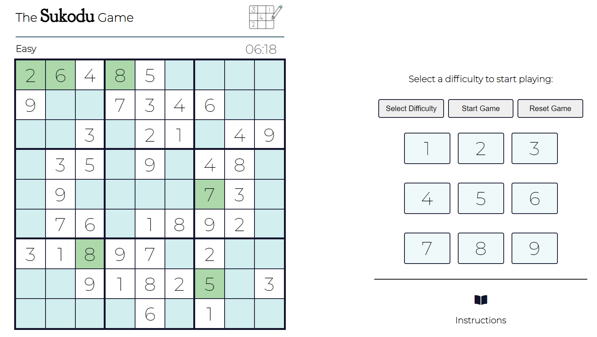
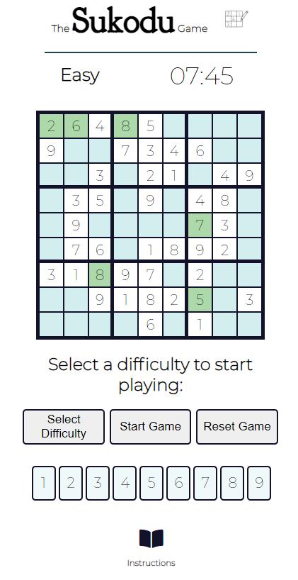

[Live Link](https://sophiebatten123.github.io/SudokuGame/)

[GitHub Repository](https://github.com/sophiebatten123/SudokuGame)

# The SUDOKU Game

(Developer: Sophie Batten)

Loose yourself in mathematical puzzles and give your mind that ‘me time’ it deserves. This website will help you to find peace in a frantic world, by putting your worries to one side. Your brain will be given a gentle workout, leaving you feeling fresh and at rest. 

To solve a sudoku puzzle, you must use a combination of logic, trial and error and mathematical thinking. The aim of the game is to complete every square, row, and column using only the numbers 1-9, all of which can only appear once.

The site itself is fully responsive and is designed in a simplistic and easy to read manner. 

# Table of Content:

- [UX](#ux)
  - [User Stories](#user-stories)
  - [Design](#design)
    - [Colour Scheme](#colour-scheme)
    - [Typography](#typography)
    - [Imagery](#imagery)
  - [Wireframes](#wireframes)
    - [Desktop Wireframe](#desktop-wireframe)
    - [Mobile Wireframe](#mobile-wireframe)
    - [Logic Function Wireframe](#logic-functions-wireframe)
    - [Site Improvements](#site-improvements)
  - [Features](#features)
    - [Game Board](#game-board)
    - [Game Keypad](#game-keypad)
    - [Game Buttons](#game-buttons)
    - [Instructions](#instructions)
    - [Game Complete](#game-complete)
  - [Deployed Website](#deployed-website)
    - [Desktop Game](#desktop-game)
    - [Mobile Game](#mobile-game)
 - [Functionality](#functionality)
    - [Fixed Bugs and Errors](#fixed-bugs-and-errors)
    - [Technologies Used](#technologies-used)
    - [Programs Used](#programs-used)
- [Testing](#testing)
    - [Manual Testing](#manual-testing)
    - [Automatic Testing](#automatic-testing)
    - [Wave Testing](#wave-testing)
- [Future Features](#future-features)
- [Deployment](#deployment)
- [Credits](#credits)

#
# UX

## User Stories

### First Time Visitor Goals:
1. As a First Time Visitor, I should be able to easily navigate the website and create a game board based upon the difficulty selection.
2. As a First Time Visitor, I should be able to read instructions on how to play Sudoku, these should be clear and easy to understand.
3. As a First Time Visitor, I should be able to restart the sudoku game and try again.
4. As a Returning Visitor, I should be able to play the game on any device

### Returning Visitor Goals:
5. As a Returning Visitor, I should be able to see the time taken to complete the puzzle and be competing against my personal best.
6. As a Returning Visitor, I should have the option to increase the difficulty of the sudoku game board.

#
# Design

## Colour Scheme

The sites primary colours are blues and whites. The image below displays the original colour scheme chosen for the website. The colour palette was created using [coolors](https://coolors.co/). 

These colours were chosen based on peace and tranquillity aiming to relax the user and prevent strain on their eyes during the game. Pastel shades were chosen to create a soft texture to the website; whilst ensuring text behind was readable.

    
Colour Scheme - Click Here:

    

#
## Typography

The websites main text was written against a white background ensuring that the text was clear and stood out to the user.

‘Montserrat’ and ‘Goudy Bookletter 1911’ were the main fonts used on the website with ‘San Serif’ as a fall-back font. The word ‘SUDOKU’ in the header was emphasised using a different font making it stand out to the user. These fonts were chosen based upon the curvature of the letters, creating a soft appearance against a harsh white background.

    
Title Font - Click Here:

    

## Imagery

A simple logo drawn to brighten up a plain page and allow the site to have a recognisable feature included within the header. This feature adds sophistication to the page and breaks up a plain background.

The instructions manual icon was taken from [Font Awesome]( https://fontawesome.com/) improving accessibility for the user and allowing for text to be hidden when not in use. 

These were the only images included on the site due to the nature of the site appealing to older audiences. The images chosen contribute towards the soft texture of the site, making the users experience more relaxing.

    
Logo - Click Here:

    

# Wireframes

To ensure that I was being efficient in my coding, wireframes were created before starting. This gave me an outline of what the website should look like and how I should incorporate logic functions into JavaScript. 

The links to these can be found below for both desktop and mobile devices:

## Desktop Wireframe

    
Sudoku Desktop Wireframe - Click Here:

    

## Mobile Wireframe

    
Sudoku Mobile Wireframe - Click Here:

    

## Logic Function Wireframe

    
Sudoku Functions Wireframe - Click Here:

    

#
# Site Improvements

Some alterations were made from the original wireframe designs to improve User Experience (UX) including: 

- The difficulty selection was changed to appear on the screen immediately when the game started. This was to avoid any confusion on how to start the game and changed based upon user testing.
- An on-screen keypad was created to improve User Experience (UX) on a mobile device. After user testing it was apparent that using a mobile keypad to play the game was exhausting and therefore by creating an on-screen keypad it made the game easier to navigate.

# Features

## Game Board

- The game board consists of 81 squares which have then been separated into 9 sub boxes and styled using pastel shades.
- Boxes are interactive for the user and change colour based on the input.
- (User Story 1)

    
Sudoku Game Board - Click Here:

    

## Game Keypad

- The keypad ensures that the game can easily be played on any device.
- (User Story 4)

    
Sudoku Desktop Keypad - Click Here:

    

## Game Buttons

- Allows the user to interact with the game and select the level of difficulty before starting.
- (User Story 1 & User Story 6)

    
Sudoku Difficulty Selection Buttons - Click Here:

    

    
Sudoku Start/Restart Buttons - Click Here:

    

## Instructions

- Explains to the user how to play the game with numbered and easy to read steps.
- (User Story 2)

    
Instructions - Click Here:

    

## Game Complete

- Displays a well-done message to the user telling them how long it took to complete the puzzle.
- (User Story 5)

    
Well Done Message - Click Here:

    

#
# Deployed Website

## Desktop Game

Above is a screenshot of the deployed website in desktop view. It was imperative throughout the design process that the game board occupied over half of the screen area; ensuring that this was the main focus to the user. 

The keypad was designed to ensure buttons could easily be accessed and that accidental clicks would be kept to a minimum during the game

## Mobile Game

A screenshot of the website from a mobile device can be seen above. Content was centered to ensure that the user could see the game board clearly and the keypad was aligned for ease of clicking.

#
# Functionality

## Fixed Bugs and Errors

|Bug/Error Identified|Reason for the error|Fix for the error|
|--------------------|--------------------|-----------------|
| The timer was increasing in pace after every game.| The timer wasnt reseting after each round.| Before the game was ran the timer was reset and initiated on runGame.|
| Correct answers were editable by the user. | Elements were part of another class attribute. | An if statement was added within the class attribute of JS.|
| The 'Well Done' message appeared before users finished. | Inputs were being pushed to an array multiple times. | Embedded 'For Loops' were removed and seperated. |
| Multiple squares could be selected at one time. | The eventListener targetted any element of that class on click. | An 'if statement' was added indicating if it was already selected.|
| A few correct answers were being marked incorrect | Elements being compared within seperate arrays did not align. | A counter element was added to each runGame function. |

#
## Technologies Used

- HTML5
- CSS
- JavaScript

## Programs Used

- [Font Awesome](https://fontawesome.com/) - The instructions manual and the exit buttons were taken from Font Awesome.
- [Am I Responsive?](http://ami.responsivedesign.is/#) - Was used to create the mockup image for the README file.
- [Google Fonts](https://fonts.google.com/) - The fonts were imported from Google Fonts.
- [GitHub](https://github.com/) - Coding platform used to create and deploy the website.
- [JSHint](https://jshint.com/) - Used to check the JavaScript functionality of the code.
- [W3C Markup Validation Service](https://validator.w3.org/) - Used to validate the HTML code.
- [W3C Jigsaw CSS Validation Service](https://jigsaw.w3.org/css-validator/) - Used to validate the CSS code.
- [Freesound](https://freesound.org/) - MP3 files were downloaded from this website.

#
# Testing

## Manual Testing

Manual testing was completed throughout the entire project and the website was continually tested on different browsers and on different screen sizes. Dev tools was used to recognise and spot errors within the code. I used the 'debugger' tool regularly to analyse logic functions that were not working as expected. 

Alongside this, I regularly generated lighthouse reports giving me an indication of how well the website was performing. Attached below is a screenshot of the websites lighthouse report at the deployment stage of my project:

    
Lighthouse Report - Click Here:

    

#
## Automatic Testing

Automatic testing of the HTML and CSS code was checked using W3C Validator ensuring that there were no errors or warnings within the code. When the website was ran through the validator no errors were present when the site was deployed.

Attached below is a screenshot of the HTML and CSS Validator showing this:

    
HTML-Validator - Click Here:

    

    
CSS-Validator - Click Here:

    

#
## WAVE Testing

WAVE was used to check the accessibility of ‘The Sudoku Game’ this was to ensure that the game features were accessible to users with disabilities. This tool highlighted errors and warnings that could prevent a disabled user using the site including: 

- Underlined heading - these were removed to improve accessibility on the website for impaired readers.

Errors and warnings were removed before the website was deployed. 

#
# Deployment

The website was deployed through GitHub and accessible through the following steps:

- Start within the GitHub repository and then navigate to the settings tab.
- Select the pages tab on the left-hand side of the settings page.
- Click on Master Branch and the page will automatically be opened with a detailed ribbon display containing the website link.

The live link to the website can be found here:

[Live-Link](https://sophiebatten123.github.io/SudokuGame/)

#
# Future Features

- In the future ‘The Sudoku Game” would benefit from a wider range of puzzles to solve as opposed to just giving three options to the user, easy, medium, and hard. This will increase the chances of users revisiting the site and prevent the user from memorizing the numbers.

- In the future the website would benefit from a "Lives Lost" section to avoid the user guessing answers.

 - In the future the website would benefit from an "online leader board” allowing users to compete against friends in an attempt to solve the puzzles in the quickest time.

#
# Credits

## Content

- The Sudoku Game Board idea was inspired from a YouTube Tutorial and the structure of this used and edited for my site: [Sudoku-Game-Tutorial](https://www.youtube.com/watch?v=ea3UBpMHDoc).
- The MP3 used on the website were taken from [Freesound](https://freesound.org/).
- The icons included throughout the website were taken from [Font-Awesome](https://fontawesome.com/).
- The colour theme was chosen using [coolors](https://coolors.co/).
- Help and support was given by the Code Institute Tutors on some of the logic functions within the website. 

Thank you to the tutors of code institute for the help given throughout this project.
